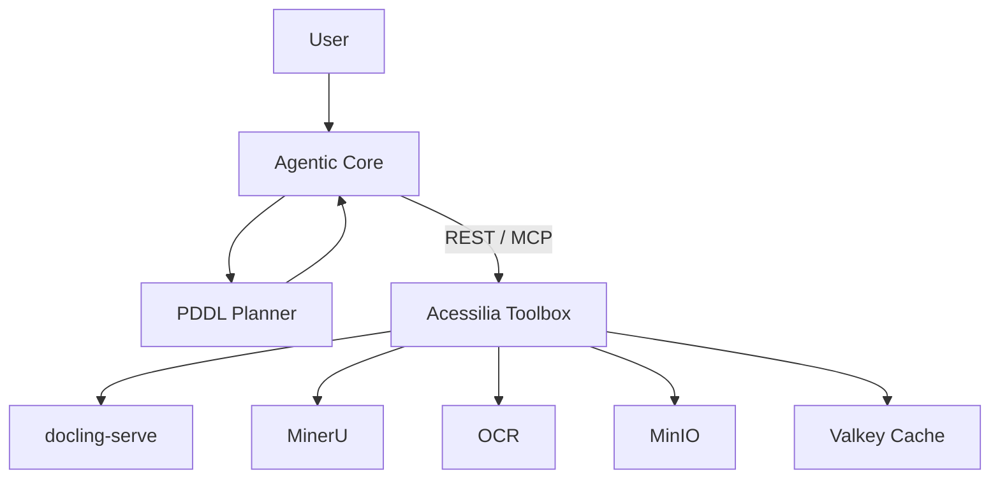

# Acessilia Toolbox

**A stateless, composable toolbox for exposing deterministic
capabilities to agentic systems via REST and MCP.**

[](https://github.com/A11yDevs/acessilia-toolbox/actions/workflows/ci.yml)
[](https://github.com/A11yDevs/acessilia-toolbox/actions/workflows/delivery.yml)
[](https://github.com/orgs/A11yDevs/packages?repo_name=acessilia-toolbox)

---

## Quick start

```bash
# 1. Install
python3 -m venv .venv && source .venv/bin/activate
pip install -e ".[dev]"

# 2. Start the extraction provider (Docker required)
docker run -d --name docling-serve -p 5001:5001 \
  -v docling-models:/root/.cache/docling \
  ghcr.io/docling-project/docling-serve-cpu:v1.32.0

# 3. Configure
export DOCLING_SERVE_URL=http://localhost:5001

# 4. Start the toolbox
uvicorn "acessilia_toolbox.api.app:create_app" --factory --host 0.0.0.0 --port 8002

# 5. Open Swagger UI
open http://localhost:8002/v1/docs
```

### Test in one command

```bash
# Health check
curl http://localhost:8002/v1/health

# List capabilities
curl http://localhost:8002/v1/capabilities | python3 -m json.tool

# Extract a document (replace with any PDF)
curl -X POST http://localhost:8002/v1/capabilities/document.structure.extract:execute \
  -F "file=@/path/to/document.pdf" \
  -F "language=pt-BR" | python3 -m json.tool | head -50
```

### No PDF at hand? Generate sample documents

```bash
python scripts/generate_samples.py
```

This creates four PDFs in `/tmp/`:

| File | Content | Purpose |
|---|---|---|
| `sample-simple.pdf` | One heading + one paragraph | Quick smoke test |
| `sample-report.pdf` | ~380 words, sections, numbers | Rich structure, metadata |
| `sample-mixed.pdf` | Lists, code block, headings | Element type diversity |
| `sample-multi-page.pdf` | 3 pages with unique content | Page-level extraction |

```bash
# Extract the report
curl -X POST http://localhost:8000/v1/capabilities/document.structure.extract:execute \
  -F "file=@/tmp/sample-report.pdf" \
  -F "language=en-US" | python3 -c "
import sys, json
r = json.load(sys.stdin)
for e in r['document']['elements']:
    print(f\"  [{e['type']}] {e['text']}\")
print(f\"  -> {r['provenance']['duration_ms']}ms via {r['provenance']['provider_version']}\")
"
```

Example output:

```
  [heading] Annual Report 2025
  [paragraph] This report summarizes the financial performance...
  [heading] 1. Executive Summary
  [paragraph] Revenue grew 15% year-over-year...
  [heading] 2. Financial Highlights
  [paragraph] Total assets: $18.7M  |  Net income: $3.2M  |  EPS: $1.45
  -> 2110ms via 1.32.0
```

---

## What is the toolbox?

A capability gateway. It exposes **what can be done** (extract structure,
OCR, store artifacts, validate accessibility) through a provider-neutral
interface, so agents and applications never couple to Docling, MinerU or
any other vendor.

| Concept | Meaning |
|---|---|
| **Capability** | Stable, provider-neutral operation (`document.structure.extract`) |
| **Provider** | External service that implements a capability (`docling-serve`) |
| **Toolbox** | Mediates between agents and providers — validates, routes, caches, normalizes |
| **Agentic Core** | Owns goals, planning, provider selection — **outside** the toolbox |

---

## Development

### From source (hot-reload)

For fast iteration with live code reloading:

```bash
# Terminal 1: providers via Docker
docker compose up -d docling-serve minio valkey

# Terminal 2: toolbox with hot-reload
python -m venv .venv && source .venv/bin/activate
pip install -e ".[dev]"
cp .env.example .env.local
# Edit .env.local with real credentials (MINIO_ACCESS_KEY, MINIO_SECRET_KEY)
# and override URLs for localhost:
#   DOCLING_SERVE_URL=http://localhost:5001
#   MINIO_URL=http://localhost:9000
#   VALKEY_URL=redis://localhost:6379
./scripts/run-local.sh
```

> The `run-local.sh` script loads `.env.local` automatically. If you prefer to run
> `uvicorn` directly, ensure all env vars are exported first:
> ```bash
# export $(grep -v '^\s*#' .env.local | xargs)
# uvicorn acessilia_toolbox.api.app:create_app --factory --host 0.0.0.0 --port 8002 --reload
```

### Full Docker Compose (providers + toolbox)

```bash
cp .env.docker .env
docker compose --profile toolbox up --build -d
curl http://localhost:8002/v1/health
```

> O serviço `toolbox` usa o profile `toolbox` para não subir junto com os providers.
> Use `docker compose up -d docling-serve minio valkey` para rodar apenas os providers
> (ideal para hot-reload com a toolbox rodando localmente via `uvicorn --reload`).

📄 See [`docs/dev-workflow.md`](docs/dev-workflow.md) for detailed instructions.

### Auto-update (staging)

The staging environment auto-updates via a systemd timer that checks for new
images every 5 minutes:

```bash
./scripts/setup-homologacao.sh
```

📄 See [`docs/auto-update.md`](docs/auto-update.md) for setup and management.

### CI/CD

| Workflow | Trigger | Action |
|---|---|---|
| **CI** | PR/push to `main`, `develop`, `release/**` | Lint + type check + pytest |
| **Delivery** | Push to `main`, `develop`, `release/**` | Build + smoke test + push to GHCR |
| **Release** | Tag `v*` | Build + push + GitHub Release |

📄 See [`CONTRIBUTING.md`](CONTRIBUTING.md) for the Git Flow model.

---

## What it can do today



## What it can do today

| Capability | Provider | Status |
|---|---|---|
| `document.structure.extract` | docling-serve, mineru-serve (optional) | ✅ |
| `document.layout.analyze` | docling-serve, mineru-serve (optional) | ✅ |
| `document.ocr` | docling-serve, mineru-serve (optional) | ✅ |
| `pdf.split`, `pdf.render` | PyMuPDF (in-process) | ✅ |
| `math.recognize` | docling-serve | ✅ |
| `math.convert`, `math.verbalize` | pure-python (in-process) | ✅ |
| `music.omr` | homr (in-process, optional extra), audiveris-serve (sidecar) | ✅ |
| `chem.recognize` | docling-serve VLM (Granite Vision) | ✅ |
| `chem.convert` | pure-python mhchem (in-process) | ✅ |
| `accessibility.validate` | pure-python (in-process) | ✅ |
| `artifact.store` / `artifact.retrieve` | MinIO (optional) | ✅ |
| `cache.get` / `cache.put` | Valkey (optional) | ✅ |

## Key endpoints

| Method | Path | Description |
|---|---|---|
| `GET` | `/v1/health` | Service status |
| `GET` | `/v1/capabilities` | List capabilities |
| `POST` | `/v1/capabilities/{id}:execute` | Execute a capability |
| `GET` | `/v1/providers` | List providers |
| `POST` | `/v1/artifacts` | Store content |
| `GET` | `/v1/artifacts/{id}` | Retrieve content |
| `GET` | `/v1/planning/domain` | PDDL domain fragment |
| `GET` | `/v1/planning/predicates` | PDDL predicates |

> Full API reference: [docs/api.md](docs/api.md)

## CLI

```bash
# List capabilities
acessilia-toolbox capabilities

# List providers and probe their health
acessilia-toolbox providers --health

# Execute a capability
acessilia-toolbox execute document.structure.extract documento.pdf -o resultado.json

# Execute with provenance on stderr
acessilia-toolbox execute document.structure.extract documento.pdf --provenance
```

### Test with sample documents

```bash
# Generate the sample PDFs
python scripts/generate_samples.py

# Extract the report
acessilia-toolbox execute document.structure.extract /tmp/sample-report.pdf \
  -o /tmp/report.json --provenance 2>/tmp/provenance.json

# Inspect the output
python3 -c "
import json
d = json.load(open('/tmp/report.json'))
for e in d['elements']:
    print(f\"  [{e['type']}] {e['text'][:80]}\")
"

# Extract the multi-page document
acessilia-toolbox execute document.structure.extract /tmp/sample-multi-page.pdf \
  -o /tmp/multi.json
python3 -c "
import json
d = json.load(open('/tmp/multi.json'))
print(f\"Pages: {d['summary']['page_count']}, Elements: {d['summary']['element_count']}\")
"

# List capabilities as JSON
acessilia-toolbox capabilities --json | python3 -m json.tool | head -20

# List providers as JSON (credentials redacted)
acessilia-toolbox providers --json | python3 -m json.tool
```

Example output:

```
$ acessilia-toolbox execute document.structure.extract /tmp/sample-report.pdf \
    --provenance 2>/dev/null
document.structure.extract@1 via docling -> /tmp/sample-report.structured-document.json
pages: 1; elements: 7; obligations: 0
```

## Documentation

| Document | What it covers |
|---|---|
| [Architecture](docs/architecture.md) | Boundaries, components, state ownership |
| [Installation](docs/installation.md) | Setup, Docker, config |
| [API](docs/api.md) | REST, MCP, error codes, manual testing |
| [Capability Model](docs/capability-model.md) | Contracts, manifests, interchangeability |
| [PDDL Integration](docs/pddl.md) | Planning semantics |
| [Testing](docs/testing.md) | Test layers, snapshot validation |
| [TeleOCR Adapter](docs/teleocr.md) | Optional image extraction, configuration and HTTP contract |
| [TeleOCR Evaluation](docs/teleocr-evaluation.md) | Local gains, failure cases, coverage and pending validation |
| [Constitution](docs/constitution.md) | Design principles |
| [Contributing](docs/contribution.md) | Workflow, PR checklist |
| [Notebooks](docs/notebooks/) | Interactive provider tour (`docs/notebooks/provider_tour.ipynb`) |

## License

MIT. Provider services retain their own licenses.
